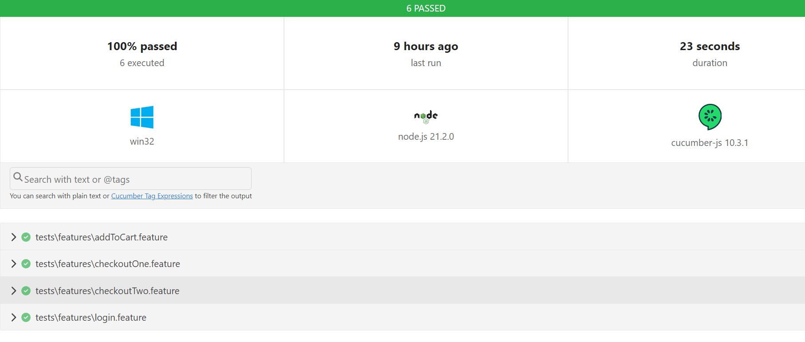

 

## Swag Labs BDD , Playwright Test Framework


         

### 🤖 Overview
This test automation framework is developed using Playwright and Cucumber to automate testing of the Swag Labs site using behaviour driven approach. It adopts the Page Object Model (POM) pattern to enhance code organization and maintenance, ensuring scalability and reusability of test scripts. The framework integrates cucumber-HTML , logger and dashboard reports to provide comprehensive insights into test execution results, facilitating effective debugging and analysis.It also have nyc code coverage.
***
### 📁 Folder Structure
```
 tests/

   features/
      login.feature
      addToCart.feature
      checkoutOne.feature
      checkoutTwo.feature

    steps/
      loginStepDefinition.ts
      addToCartStepDefinition.ts
      checkoutOneStepDefinition.ts
      checkoutTwoStepDefinition.ts
  
    src/

      data/
            data.json
            userData.xlsx

      pageObjects/
            cartLocator.ts
            checkoutStepOneLocators.ts
            checkoutStepTwoLocators.ts
            loginLocator.ts
            productsLocator.ts
    
    hooks/
        hooks.ts
        pageFixture.ts
    
    helper/
        report.ts

```

***

## 📁 Project Structure Overview

In the project structure provided, we can categorize the different components into the following sections:

### Test Files
- **tests/**: This section contains all the test files.
  - **features/**: Subfolder with feature files defining test scenarios.
    - **login.feature**: Feature file for the login scenario.
    - **addToCart.feature**: Feature file for the add to cart scenario.
    - **checkoutOne.feature**: Feature file for checkout step 1 scenario.
    - **checkoutTwo.feature**: Feature file for checkout step 2 scenario.
  - **steps/**: Subfolder with step definition files for each scenario.
    - **loginStepDefinition.ts**: Step definitions for the login scenario.
    - **addToCartStepDefinition.ts**: Step definitions for the add to cart scenario.
    - **checkoutOneStepDefinition.ts**: Step definitions for checkout step 1.
    - **checkoutTwoStepDefinition.ts**: Step definitions for checkout step 2.

### Source Code
- **src/**: This section contains the source code of the project.
  - **data/**: Subfolder with data files used in the project.
    - **data.json**: JSON data file used in the project.
    - **userData.xlsx**: Excel data file used in the project.
  - **pageObjects/**: Subfolder with page object files defining elements on each page.
    - **cartLocator.ts**: Locators for the cart page.
    - **checkoutStepOneLocators.ts**: Locators for checkout step 1 page.
    - **checkoutStepTwoLocators.ts**: Locators for checkout step 2 page.
    - **loginLocator.ts**: Locators for the login page.
    - **productsLocator.ts**: Locators for the products page.

### Hooks and Fixtures
- **hooks/**: This section contains hooks and fixtures used in the project.
  - **hooks.ts**: File with hooks executed before and after each scenario.
  - **pageFixture.ts**: File with fixtures used to set up and tear down the test environment.

### Helper Functions
- **helper/**: This section contains helper functions used in the project.
  - **report.ts**: File containing code for generating test reports.

This breakdown provides a clear overview of how different components are organized within the project structure, making it easier to navigate and understand each part's role in the testing process.

***

## ✨ New Features

In this project, the following new features have been added:

- **Screenshots**: Screenshots are taken after each scenario to provide a visual representation of the test results.
- **Logger**: A logger has been implemented for each scenario to track and record the test results.
- **NYC Code Coverage**: NYC code coverage has been implemented to measure the test coverage and identify any untested code.
- **Dashboard Report**: A dashboard report has been added to provide an easy-to-read and convenient view of the test results.

These new features provide enhanced functionality and convenience for testing and reporting purposes, making it easier to track and analyze the test results.


## 💻 Technologies Used
- **🎭 Playwright**: Automation library for web applications. 
- ** JavaScript**: Programming language used for scripting. 
- ** Typescript** : Markup language for creating web pages. 
- ** Cucumber**: BDD tool. 

***

## ✔ Installation

```bash
   git clone https://github.com/sudeepshukla930/SwagLabs_playwright_cucumber.git
```

install dependencies

```bash
   npm install
```

## 🚀 Usage

###  Running Tests

- **Runs all features files** 

```
npm test

```


## 📈 Reports & Code coverage generation

- **Cucumber HTML Report:** It has 2 steps 

   - Step 1 : runs test after mentioning html report property in *cucumber.json*

        ```
        npm test
        ```
        above create default cumber html report.

    - Step 2: Open report by navigating inside :

        ```
        test-result > cucumber-report.html
        ```


- **Cucumber Dashboard Report:** It has 2 steps 

   - Step 1 : runs test 

        ```
        npm run report
        ```
        above create dashboard html report.

    - Step 2: Open report by navigating inside :

        ```
        test-result > dashboard > index.html
        ```

- **nyc generate** 

```
npm run test:coverage

```

***

## 📈 Reports

- **Dashboard Report**:


- **Html Report**:




***


## 📌 Keypoints:

- The project follow BDD approach where we used cucumber and integrated it with playwright


- The step definitions are mapped to the corresponding steps in the feature files using the Cucumber framework.

- The project includes a logger for tracking and recording the test results.

- The project also includes screenshots and code coverage reports for each scenario.

- The dashboard report provides an easy-to-read and convenient view of the test results.

- The project structure is organized into different sections, including test files, source code, hooks and fixtures, and helper functions.

*******************************
********************


   **<h2 align="center"> Contributed by <a href="https://github.com/sudeepshukla930">Sudeep Shukla</a> With 💜. </h2>**


 